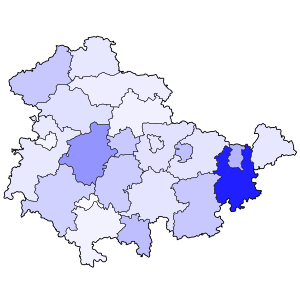

# corona-jena

Erfassung und Visualisierung der Corona-Fallzahlen für Thüringen und ausgewählte Kommunen. Aktuell läuft eine stündliche Aktualisierung der Fallzahlen auf meinem Webserver. Die Daten werden bis auf wenige Ausnahmen automatisiert abgerufen und die entsprechenden Abbildungen aktualisiert.

Zahlen von bestätigten COVID19-Fällen von offiziellen Stellen wie dem Land Thüringen oder Bundesstellen wie etwa dem Robert Koch-Institut sind leider mit einer gewissen Meldeverzögerung verbunden. Dies ist mit der Meldekette zu begründen, kann aber abseits dessen auch andere Gründe haben, wie etwa einer kurzfristigen Überlastung der meldenden Gesundheitsämter vor Ort. Daher war es eine initiale Idee dieses Projekts die bestätigten Coronavirus-Fallzahlen auf der kommunalen Ebene möglichst automatisiert zu erfassen, um ein genaueres Bild über die Gesamtsituation vor Ort zu haben. Zusätzlich werden diese Daten visuell aufbereitet, getreu dem Sprichwort "ein Bild sagt mehr als 1000 Worte". Dies soll helfen die regionalen Unterschiede zu erfassen und darzustellen sowie das exponentielle Wachstum einer Pandemie leichter verständlich zu machen. An ausgewählten Daten werden exponentielle Anpassungsfunktionen ("Fits") angewandt, um damit Parameter wie die Fallzahl-Dopplungsrate zu bestimmen. Daraus können im Nachhinein gegebenenfalls Rückschlüsse auf die Wirksamkeit verordneter Maßnahmen geschlossen werden.

Dieses Repository dient neben der Bereitstellung des Projekt-Quelltextes für Interessenten auch der Zurverfügungstellung der gesammelten [Daten](/data/).

## Coronavirus-Datenquellen

Dieses Projekt verwendet einige der folgdenden offiziellen Quellen der Kommunen und des Freistaats Thüringen:

| #  | kreisfreie Stadt / Landkreis     | Abruf der Daten? | Art der Datenerhebung auf Homepage | Webseite                                                                                                                                                                                                                                               |
|----|----------------------------------|------------------|------------------------------------|--------------------------------------------------------------------------------------------------------------------------------------------------------------------------------------------------------------------------------------------------------|
|    | Thüringen                        | ja               | T                                  | [https://www.landesregierung-thueringen.de](https://www.landesregierung-thueringen.de/corona-bulletin)                                                                                                                                                 |
|    | Thüringen (RKI)                  | ja               | T                                  | [https://www.rki.de](https://www.rki.de/DE/Content/InfAZ/N/Neuartiges_Coronavirus/Fallzahlen.html)                                                                                                                                                     |
|    | Deutschland (RKI)                | ja               | T                                  | [https://www.rki.de](https://www.rki.de/DE/Content/InfAZ/N/Neuartiges_Coronavirus/Fallzahlen.html)                                                                                                                                                     |
|    |                                  |                  |                                    |                                                                                                                                                                                                                                                        |
| 1  | Altenburger Land                 | -                | T, A                               | [https://www.altenburgerland.de](https://www.altenburgerland.de/sixcms/detail.php?&_nav_id1=2508&_lang=de&id=371691)                                                                                                                                   |
| 2  | Eichsfeld                        | ja               | T                                  | [https://www.kreis-eic.de](https://www.kreis-eic.de/aktuelle-fallzahlen-im-landkreis-eichsfeld.html)                                                                                                                                                   |
| 3  | Eisenach                         | -                | T                                  | [https://www.wartburgkreis.de](https://www.wartburgkreis.de/leben-im-wartburgkreis/gesundheit/aktuelle-informationen-zum-corona-virus)                                                                                                                 |
| 4  | Erfurt                           | manuell          | P                                  | [https://www.erfurt.de](https://www.erfurt.de/ef/de/service/aktuelles/am/index.itl)                                                                                                                                                                    |
| 5  | Gera                             | ja               | T                                  | [https://corona.gera.de](https://corona.gera.de/)                                                                                                                                                                                                      |
| 6  | Landkreis Gotha                  | -                | I                                  | [https://www.landkreis-gotha.de](https://www.landkreis-gotha.de/)                                                                                                                                                                                      |
| 7  | Landkreis Greiz                  | -                | T, A?                              | [https://www.landkreis-greiz.de](https://www.landkreis-greiz.de/landkreis-greiz/aktuell/nachrichten-details/?tx_ttnews%5Btt_news%5D=224&cHash=74595518f951c32f22d04b7591d643fe)                                                                        |
| 8  | Landkreis Hildburghausen         | -                | P                                  | [https://www.landkreis-hildburghausen.de](https://www.landkreis-hildburghausen.de/Aktuelles-Corona-Virus)                                                                                                                                              |
| 9  | Ilm-Kreis                        | -                | P                                  | [https://www.ilm-kreis.de](https://www.ilm-kreis.de/Landkreis/Ver%C3%B6ffentlichungen/Pressearchiv/index.php?ModID=255&NavID=2778.25&text=Coronavirus)                                                                                                 |
| 10 | Jena                             | ja               | O, T                               | [https://gesundheit.jena.de](https://gesundheit.jena.de/de/coronavirus), [OpenData Tabelle](https://opendata.jena.de/dataset/2cc7773d-beba-43ad-9808-a420a67ffcb3/resource/d3ba07b6-fb19-451b-b902-5b18d8e8cbad/download/corona_erkrankungen_jena.csv) |
| 11 | Kyffhäuserkreis                  | -                | -                                  | [https://www.kyffhaeuser.de](https://www.kyffhaeuser.de/kyf/index.php/landkreis.html)                                                                                                                                                                  |
| 12 | Landkreis Nordhausen             | ja               | T                                  | [https://www.landratsamt-nordhausen.de](https://www.landratsamt-nordhausen.de/informationen-coronavirus.html)                                                                                                                                          |
| 13 | Saale-Holzland-Kreis             | -                | T, P?                              | [https://www.saaleholzlandkreis.de](https://www.saaleholzlandkreis.de/corona-virus/aktuelle-infos/)                                                                                                                                                    |
| 14 | Saale-Orla-Kreis                 | ja               | T                                  | [https://www.saale-orla-kreis.de](https://www.saale-orla-kreis.de/sok/)                                                                                                                                                                                |
| 15 | Landkreis Saalfeld-Rudolstadt    | -                | G                                  | [http://www.kreis-slf.de](http://www.kreis-slf.de/landratsamt/)                                                                                                                                                                                        |
| 16 | Landkreis Schmalkalden-Meiningen | -                | P, D                               | [https://www.lra-sm.de](https://www.lra-sm.de/?p=22632)                                                                                                                                                                                                |
| 17 | Suhl                             | -                | T, A                               | [https://www.suhltrifft.de](https://www.suhltrifft.de/content/blogsection/41/2246/)                                                                                                                                                                    |
| 18 | Landkreis Sömmerda               | -                | P, D                               | [https://www.lra-soemmerda.de](https://www.lra-soemmerda.de/)                                                                                                                                                                                          |
| 19 | Landkreis Sonneberg              | -                | P                                  | [https://www.kreis-sonneberg.de](https://www.kreis-sonneberg.de/)                                                                                                                                                                                      |
| 20 | Unstrut-Hainich-Kreis            | -                | T                                  | [https://www.unstrut-hainich-kreis.de](https://www.unstrut-hainich-kreis.de/index.php/informationen-zum-neuartigen-coronavirus)                                                                                                                        |
| 21 | Wartburgkreis                    | -                | T                                  | [https://www.wartburgkreis.de](https://www.wartburgkreis.de/leben-im-wartburgkreis/gesundheit/aktuelle-informationen-zum-corona-virus)                                                                                                                 |
| 22 | Weimar                           | ja               | T                                  | [https://stadt.weimar.de](https://stadt.weimar.de/aktuell/coronavirus)                                                                                                                                                                                 |
| 23 | Weimarer Land                    | -                | -                                  | [https://weimarerland.de](https://weimarerland.de/index_lra.html)                                                                                                                                                                                      |

Art der Datenerhebung auf Homepage (Legende):
 - A: veraltete Daten
 - D: Dokument (PDF)
 - G: Grafik (JPG)
 - I: interaktive Grafik
 - O: OpenData (CSV)
 - P: Pressemitteilungen
 - T: Text

## benötigte Software
- Python 3
- gnuplot (Version >= 5.0)
- awk
- ImageMagick

## weitere Projekte

Eine Liste weiterer ähnlicher Github-Projekte, die COVID19-Daten für Deutschland erfassen und auswerten:

* Deutschland: [github.com/micgro42/COVID-19-DE](https://github.com/micgro42/COVID-19-DE)
* Bayern: [github.com/koepferl/COVID19Dahoam](https://github.com/koepferl/COVID19Dahoam)
* Niedersachsen: [github.com/codeforosnabrueck/COVID-19-NDS/](https://github.com/codeforosnabrueck/COVID-19-NDS/)

## Sonstiges
Fehler? Wünsche? Verbesserungsvorschläge? Dann lasst sie uns wissen und fügt sie dem [Bug-Tracker](https://github.com/micb25/corona-jena/issues) hinzu.

